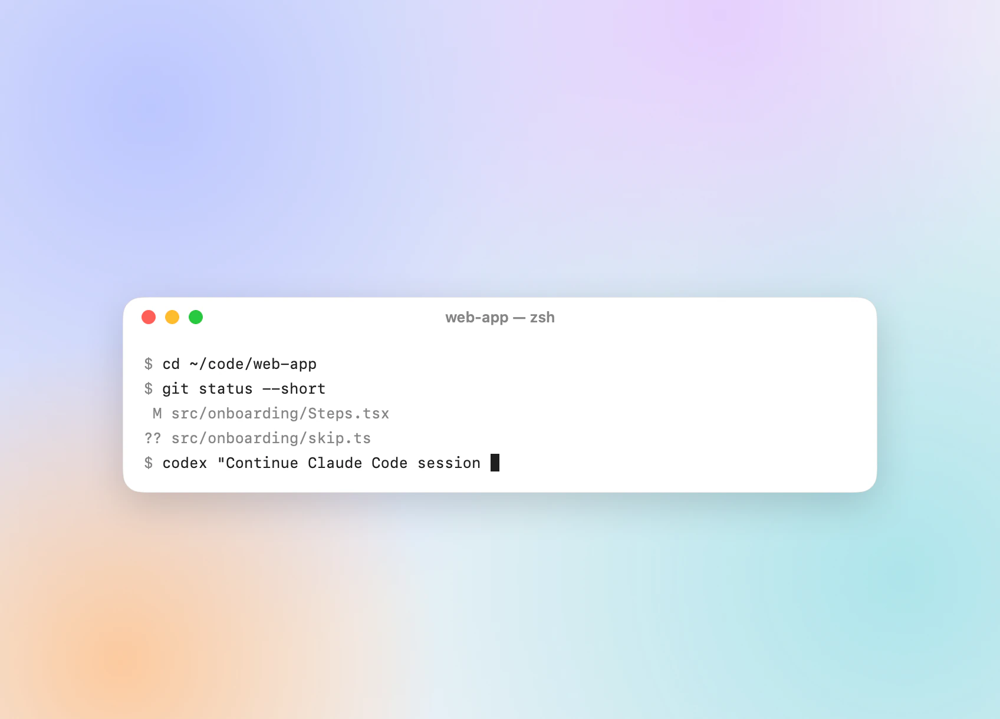
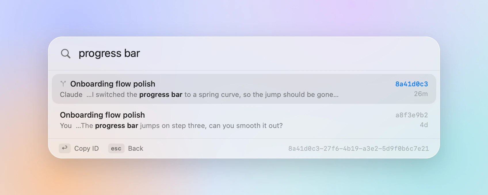
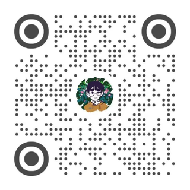

<div align="center">


# ccid

Find any Claude Code session ID in a keystroke.

<p><b>English</b> · <a href="README.zh-CN.md">简体中文</a></p>

<a href="https://github.com/AppApp777/ccid/releases/latest"></a>


<a href="LICENSE"></a>

<br>

<picture>
  <source media="(prefers-color-scheme: dark)" srcset="docs/demo-dark.webp">
  
</picture>

</div>

Every Claude Code conversation has an ID. Hand it to Codex or any other agent and it can read the conversation and pick up where Claude left off. `claude --resume` and your scripts take the same ID. The Claude app doesn't show it. ccid does.

Press <kbd>⌃</kbd><kbd>⌘</kbd><kbd>I</kbd> anywhere, type a few letters of the title, press <kbd>↩</kbd>. The ID is on your clipboard and the panel is gone.

## Download

**[Download ccid-macos.zip](https://github.com/AppApp777/ccid/releases/latest/download/ccid-macos.zip)** (1.6 MB) · macOS 14 or later · Apple silicon and Intel

Unzip it, drag **ccid** to Applications, and open it. ccid isn't notarized by Apple, so macOS stops it the first time:

- **macOS 15 and later:** click **Done** on the warning, open **System Settings → Privacy & Security**, and click **Open Anyway** next to the line about ccid. Confirm once more.
- **macOS 14:** Control-click ccid in Applications, choose **Open**, then click **Open**.

That's needed once. If macOS stops the `ccid` command the first time you run it in Terminal, allow it the same way. Each release includes `SHA256SUMS.txt`; `shasum -a 256 ccid-macos.zip` should print the same checksum.

## What it does

- **Finds sessions by what you remember.** A title, a folder, or something you said. Pinyin works too: `zmt` finds 自媒体.
- **Searches every transcript.** <kbd>⌘</kbd><kbd>↩</kbd> looks for an exact phrase in every conversation and shows who said it, you or Claude.
- **Knows the Claude app and the terminal.** Sessions from the desktop app, `claude` in a terminal, and editors all show up. Forks are marked, and archived sessions are kept out of the way.
- **Stays out of the way.** It lives in the menu bar and never takes focus from the app you were in, so you can paste straight away.
- **Comes with a command-line tool** for scripts: `codex "Continue Claude Code session $(ccid -1 auth)"`.
- **Only reads.** No network, no analytics, no permissions to grant.

<picture>
  <source media="(prefers-color-scheme: dark)" srcset="docs/transcripts-dark.webp">
  
</picture>

## Keys

| | |
|---|---|
| <kbd>⌃</kbd><kbd>⌘</kbd><kbd>I</kbd> | Open or close the panel (change it in the menu) |
| <kbd>↑</kbd> <kbd>↓</kbd> | Move through sessions (<kbd>⌃</kbd><kbd>N</kbd> <kbd>⌃</kbd><kbd>P</kbd> work too) |
| <kbd>↩</kbd> | Copy the ID and close |
| <kbd>⌘</kbd><kbd>↩</kbd> | Search every transcript for what you typed |
| <kbd>esc</kbd> | Go back a step: transcript results, then your search, then the panel |

Right-click a session to copy a command that resumes it in its folder, or to show its transcript in Finder. Click the menu bar icon to open the panel; right-click it for settings.

## Command line

Choose **Install Command Line Tool…** from the menu to get `ccid` in Terminal.

```bash
ccid                       # recent sessions
ccid auth                  # filter by title, folder, pinyin, or what you said
ccid -g "progress bar"     # sessions whose transcript contains a phrase
ccid -1 auth               # just the best match's ID
ccid -c auth               # copy it
eval "$(ccid -r auth)"     # cd to its folder and resume it
ccid --json                # the same list as JSON
```

`ccid --help` lists every option. The session you're running it from is marked with ●.

## How it works

The Claude app keeps a small file for each session in `~/Library/Application Support/Claude/claude-code-sessions`, with its title, folder, archive state, and the session it was forked from. Claude Code writes each conversation to `~/.claude/projects/<folder>/<id>.jsonl` (or under `$CLAUDE_CONFIG_DIR`), and the file name is the ID.

ccid joins the two. Sessions started in a terminal are named by their `/rename` title or first message. "Last active" is whichever is newer: the app's own timestamp or the transcript's. Transcripts are read from the end, a little at a time, so even very long ones are quick.

## Questions

**How does another agent pick up a session?** Give it the ID and say it's a Claude Code session, as in `codex "Continue Claude Code session <ID>"`. The whole conversation is in `~/.claude/projects/<folder>/<ID>.jsonl`. An agent that can run commands can find it from the ID alone; if one doesn't, point it to that folder.

**Why did my session get a new ID?** Forking creates a new session with its own ID. ccid marks forks with ⑂, and hovering the mark shows where it came from.

**The shortcut does nothing.** Another app probably uses it. Pick a different one from the menu.

**Can I try it without showing my own sessions?** Quit ccid, then open it with made-up ones: `open --env CCID_DEMO=1 /Applications/ccid.app`.

**How do I uninstall it?** Turn off **Open at Login** in its menu if you turned it on, quit it, and drag it to the Trash. If you installed the command-line tool, also run `sudo rm /usr/local/bin/ccid`. The only file ccid writes is `~/Library/Preferences/io.github.appapp777.ccid.plist`, and only if you changed the shortcut.

## Feedback

Bugs and ideas go in [Issues](https://github.com/AppApp777/ccid/issues).

## License

[MIT](LICENSE): you can use, change, and share the code, commercially too, as long as the copyright notice stays. It comes with no warranty.

ccid is an independent project, not affiliated with or endorsed by Anthropic. Claude and Claude Code are trademarks of Anthropic, PBC.

## About the author

Made by 七也 (Qiye), who is also on Douyin and Xiaohongshu:

| Douyin | Xiaohongshu |
|:---:|:---:|
|  |  |
| 七也 · `miao1162603325` | 七也 · `5441921009` |

## Recent changes

**2026-09-25 · v1.0.0**: the first release. The full list is in [CHANGELOG.md](CHANGELOG.md).

---

<details>
<summary><b>Build from source</b></summary>

<br>

You need Xcode 16 or later (Xcode 26 for Liquid Glass).

```bash
git clone https://github.com/AppApp777/ccid.git
cd ccid
scripts/build-app.sh     # dist/ccid.app for this Mac; UNIVERSAL=1 for Apple silicon and Intel
swift test               # tests for the core (Sources/CCIDCore)
swift run ccid           # the command-line tool, from source
```

`scripts/package.sh` builds the release zip and its checksum. `CCID_CLASSIC=1` shows the pre-macOS 26 look on macOS 26, and `scripts/make-icon.sh` redraws the icon. [AGENTS.md](AGENTS.md) has the layout and the rules for changes.

</details>
