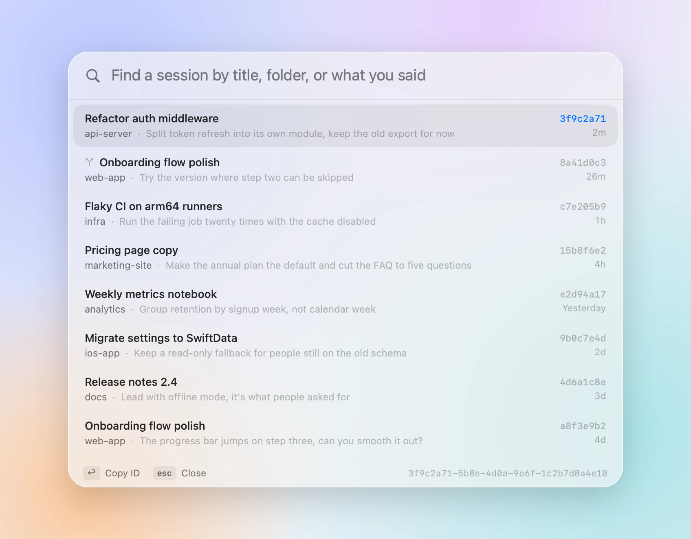

<p align="center">
  
</p>

<h1 align="center">ccid</h1>

<p align="center">
  Find any Claude Code session ID in a keystroke.
  <br>
  <a href="README.zh-CN.md">简体中文</a>
</p>

<br>

<picture>
  <source media="(prefers-color-scheme: dark)" srcset="docs/panel-dark.webp">
  
</picture>

Every Claude Code conversation has an ID. You need it for `claude --resume`, for scripts, and for pointing one session at another. The Claude app doesn't show it. ccid does.

Press <kbd>⌃</kbd><kbd>⌘</kbd><kbd>I</kbd> anywhere, type a few letters of the title, press <kbd>↩</kbd>. The ID is on your clipboard and the panel is gone.

## What it does

- **Finds sessions by what you remember.** A title, a folder, or something you said. Pinyin works too: `zmt` finds 自媒体.
- **Searches every transcript.** <kbd>⌘</kbd><kbd>↩</kbd> looks for an exact phrase in every conversation and shows who said it, you or Claude.
- **Knows the Claude app and the terminal.** Sessions from the desktop app, `claude` in a terminal, and editors all show up. Forks are marked, and archived sessions are kept out of the way.
- **Stays out of the way.** It lives in the menu bar and never takes focus from the app you were in, so you can paste straight away.
- **Comes with a command-line tool** for scripts: `claude --resume "$(ccid -1 auth)"`.
- **Only reads.** No network, no analytics, no permissions to grant.

<picture>
  <source media="(prefers-color-scheme: dark)" srcset="docs/transcripts-dark.webp">
  
</picture>

## Install

ccid runs on macOS 14 or later, and uses Liquid Glass on macOS 26. There's no signed download yet, so build it from source. It takes about a minute with Xcode 16 or later (Xcode 26 for Liquid Glass):

```bash
git clone https://github.com/AppApp777/ccid.git
cd ccid
scripts/build-app.sh
cp -R dist/ccid.app /Applications/
open /Applications/ccid.app
```

To use `ccid` in a terminal, choose **Install Command Line Tool…** from its menu.

## Keys

| | |
|---|---|
| <kbd>⌃</kbd><kbd>⌘</kbd><kbd>I</kbd> | Open or close the panel (change it in the menu) |
| <kbd>↑</kbd> <kbd>↓</kbd> | Move through sessions (<kbd>⌃</kbd><kbd>N</kbd> <kbd>⌃</kbd><kbd>P</kbd> work too) |
| <kbd>↩</kbd> | Copy the ID and close |
| <kbd>⌘</kbd><kbd>↩</kbd> | Search every transcript for what you typed |
| <kbd>esc</kbd> | Go back a step: transcript results, then your search, then the panel |

Right-click a session to copy a command that resumes it in its folder, or to show its transcript in Finder. Click the menu bar icon to open the panel; right-click it for settings.

## Command line

```bash
ccid                       # recent sessions
ccid auth                  # filter by title, folder, pinyin, or what you said
ccid -g "progress bar"     # sessions whose transcript contains a phrase
ccid -1 auth               # just the best match's ID
ccid -c auth               # copy it
eval "$(ccid -r auth)"     # cd to its folder and resume it
ccid --json                # the same list as JSON
```

`ccid --help` lists every option. The session you're running it from is marked with ●.

## How it works

The Claude app keeps a small file for each session in `~/Library/Application Support/Claude/claude-code-sessions`, with its title, folder, archive state, and the session it was forked from. Claude Code writes each conversation to `~/.claude/projects/<folder>/<id>.jsonl` (or under `$CLAUDE_CONFIG_DIR`), and the file name is the ID.

ccid joins the two. Sessions started in a terminal are named by their `/rename` title or first message. "Last active" is whichever is newer: the app's own timestamp or the transcript's. Transcripts are read from the end, a little at a time, so even very long ones are quick.

## Questions

**Why did my session get a new ID?** Forking creates a new session with its own ID. ccid marks forks with ⑂, and hovering the mark shows where it came from.

**The shortcut does nothing.** Another app probably uses it. Pick a different one from the menu.

**Can I try it without showing my own sessions?** Quit ccid, then open it with made-up ones: `open --env CCID_DEMO=1 /Applications/ccid.app`.

## Development

```bash
swift test               # tests for the core (Sources/CCIDCore)
swift run ccid           # the command-line tool, from source
scripts/build-app.sh     # dist/ccid.app; UNIVERSAL=1 for Apple silicon and Intel
```

`CCID_CLASSIC=1` shows the pre-macOS 26 look on macOS 26. `scripts/make-icon.sh` redraws the icon.

## License

[MIT](LICENSE). ccid is an independent project, not affiliated with or endorsed by Anthropic. Claude and Claude Code are trademarks of Anthropic, PBC.
