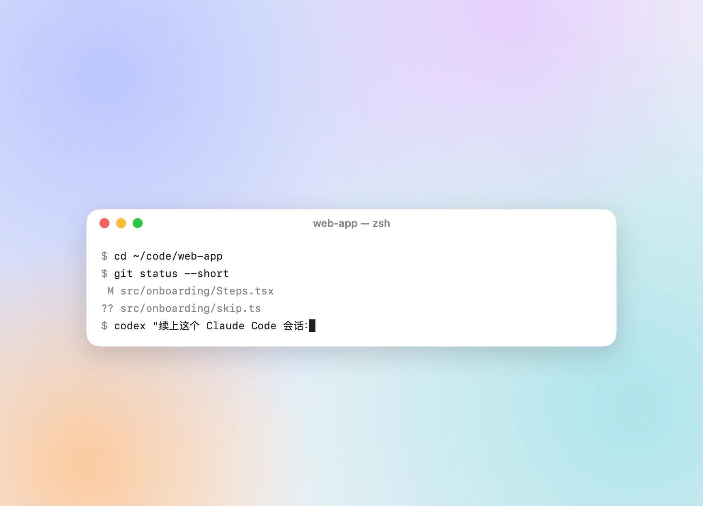
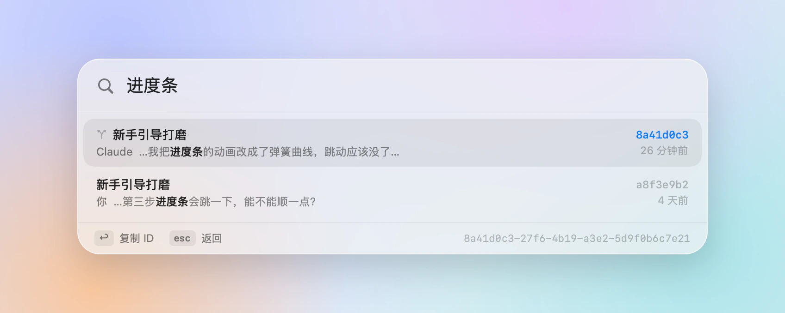

<div align="center">


# ccid

一个快捷键，找到任何 Claude Code 会话的 ID。

<p><a href="README.md">English</a> · <b>简体中文</b></p>

<a href="https://github.com/AppApp777/ccid/releases/latest"></a>


<a href="LICENSE"></a>

<br><br>

<picture>
  <source media="(prefers-color-scheme: dark)" srcset="docs/demo-zh-dark.webp">
  
</picture>

</div>

每个 Claude Code 会话都有一个 ID：`claude --resume` 要用，脚本要用，让一个会话去看另一个会话也要用。Claude 应用里看不到它，ccid 能。

在任何地方按 <kbd>⌃</kbd><kbd>⌘</kbd><kbd>I</kbd>，敲几个标题里的字，回车。ID 已经在剪贴板里，面板也收起来了。

## 下载

**[⬇ 下载 ccid-macos.zip](https://github.com/AppApp777/ccid/releases/latest/download/ccid-macos.zip)**（1.6 MB）· macOS 14 或更新 · Apple 芯片和 Intel 都能用

解压，把 **ccid** 拖进“应用程序”，打开。ccid 没有经过 Apple 公证，所以第一次打开时 macOS 会拦下来：

- **macOS 15 及更新**：在提示框里点“完成”，打开“系统设置 → 隐私与安全性”，在提到 ccid 的那一行旁边点“仍要打开”，再确认一次。
- **macOS 14**：在“应用程序”里按住 Control 点 ccid，选“打开”，再点“打开”。

只需要这一次。第一次在终端里运行 `ccid` 命令时如果也被拦，照同样的办法放行。每个版本都附有 `SHA256SUMS.txt`，可以用 `shasum -a 256 ccid-macos.zip` 核对下载的文件。

## 能做什么

- **凭印象找会话**：标题、文件夹、说过的话都行。拼音也行，`zmt` 能找到“自媒体”，`cg` 能找到“重构”。
- **翻遍全部记录**：<kbd>⌘</kbd><kbd>↩</kbd> 在所有会话里找一句原话，还告诉你是你说的还是 Claude 说的。
- **应用和终端都认**：Claude 应用、终端里的 `claude`、编辑器里开的会话都在。分叉的会话有标记，归档的不占地方。
- **不打扰**：住在菜单栏，不抢你当前应用的焦点，复制完直接粘贴。
- **带命令行工具**，写脚本用：`claude --resume "$(ccid -1 登录)"`。
- **只读**：不联网，不统计，不用授权任何权限。

<picture>
  <source media="(prefers-color-scheme: dark)" srcset="docs/transcripts-zh-dark.webp">
  
</picture>

## 按键

| | |
|---|---|
| <kbd>⌃</kbd><kbd>⌘</kbd><kbd>I</kbd> | 打开或关闭面板（可在菜单里换） |
| <kbd>↑</kbd> <kbd>↓</kbd> | 上下选（<kbd>⌃</kbd><kbd>N</kbd> <kbd>⌃</kbd><kbd>P</kbd> 也行） |
| <kbd>↩</kbd> | 复制 ID 并关闭 |
| <kbd>⌘</kbd><kbd>↩</kbd> | 在全部记录里找你输入的话 |
| <kbd>esc</kbd> | 退一步：先退出全文结果，再清空输入，最后关闭面板 |

右键某个会话，可以复制“回到它所在文件夹并恢复”的命令，或在访达里显示它的记录文件。点菜单栏图标打开面板，右键图标是设置。

## 命令行

在菜单里选“安装命令行工具…”，终端里就能用 `ccid`。

```bash
ccid                       # 最近的会话
ccid 登录                  # 按标题、文件夹、拼音或说过的话筛
ccid -g "进度条"           # 记录里说过这句话的会话
ccid -1 登录               # 只要最匹配那个的 ID
ccid -c 登录               # 直接复制
eval "$(ccid -r 登录)"     # 进到它的文件夹并恢复会话
ccid --json                # 同样的列表，JSON 格式
```

`ccid --help` 列出全部选项。在哪个会话里运行，哪个会话前面就有 ●。

## 原理

Claude 应用给每个会话存一个小文件，在 `~/Library/Application Support/Claude/claude-code-sessions`，里面有标题、文件夹、是否归档、从哪个会话分叉。Claude Code 把每段对话写进 `~/.claude/projects/<文件夹>/<ID>.jsonl`（设了 `CLAUDE_CONFIG_DIR` 就在那下面），文件名就是 ID。

ccid 把两边对上。在终端里开的会话，用 `/rename` 起的名字或第一句话当标题。“最近活动”取应用记录的时间和记录文件修改时间里较新的那个。记录文件从末尾一点点往前读，再长也快。

## 常见问题

**会话的 ID 怎么变了？** 分叉会生成一个新会话，ID 也是新的。ccid 用 ⑂ 标出分叉，鼠标停在上面能看到它从哪来。

**快捷键没反应。** 多半被别的应用占了，在菜单里换一个。

**想试用又不想露出自己的会话？** 先退出 ccid，再用演示数据打开：`open --env CCID_DEMO=1 /Applications/ccid.app`。

**怎么卸载？** 如果在菜单里开过“登录时打开”，先关掉；退出 ccid，把它拖进废纸篓。装过命令行工具的话，再运行 `sudo rm /usr/local/bin/ccid`。ccid 唯一会写的文件是 `~/Library/Preferences/io.github.appapp777.ccid.plist`，而且只在你改过快捷键时才有。

## 问题反馈

用着有问题或者有建议，开一个 [Issue](https://github.com/AppApp777/ccid/issues) 就行。

## 许可

[MIT](LICENSE)：可以使用、修改、再分发，商用也可以，保留版权声明就行；作者不对使用后果负责。

ccid 是独立项目，与 Anthropic 无关联，也未获其背书。Claude 和 Claude Code 是 Anthropic, PBC 的商标。

## 关于作者

七也。日常发在这两个地方：

| 抖音 | 小红书 |
|:---:|:---:|
|  |  |
| 七也 · `miao1162603325` | 七也 · `5441921009` |

## 最近更新

**2026-09-25 · v1.0.0**：第一版。完整记录在 [CHANGELOG.md](CHANGELOG.md)。

---

<details>
<summary><b>给开发者的：从源码构建</b></summary>

<br>

需要 Xcode 16 或更新版本（液态玻璃要 Xcode 26）。

```bash
git clone https://github.com/AppApp777/ccid.git
cd ccid
scripts/build-app.sh     # 生成 dist/ccid.app；UNIVERSAL=1 同时构建 Apple 芯片和 Intel 版
swift test               # 核心逻辑的测试（Sources/CCIDCore）
swift run ccid           # 从源码跑命令行工具
```

`scripts/package.sh` 打出发布用的压缩包和校验和。`CCID_CLASSIC=1` 可以在 macOS 26 上看旧系统的外观，`scripts/make-icon.sh` 重画图标。[AGENTS.md](AGENTS.md) 写了代码结构和改动规矩。

</details>
